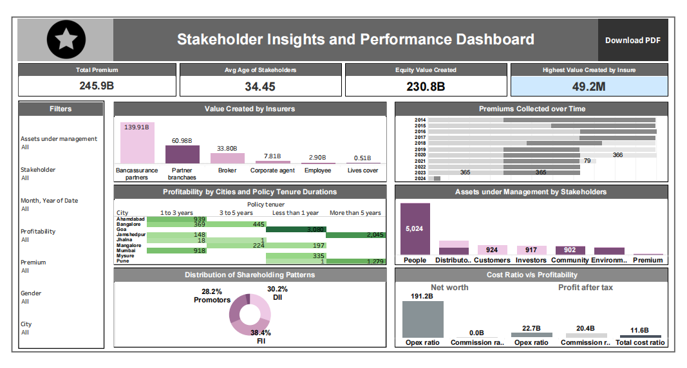

# 📊 Stakeholder Insights & Performance Dashboard

An end-to-end interactive **Tableau Business Intelligence Dashboard** engineered to track, analyze, and visualize multi-dimensional performance metrics across insurance entities, stakeholder demographics, financial portfolios, and regional profitability.

---

## 🚀 Project Overview

The **Stakeholder Insights & Performance Dashboard** bridges raw insurance and financial data with executive decision-making. By consolidating disjointed metrics into a cohesive, interactive BI interface, this project enables stakeholders to evaluate value creation drivers, premium collection trends, geographic profitability, shareholding structures, and capital allocation across Assets Under Management (AUM).

---

## 🎯 Key Business Questions Addressed

- **Insurer Performance:** Which partner categories and distribution channels generate the highest overall value?
- **Revenue Trends:** How do premium collections trajectory-shift across multi-year cycles?
- **Regional Profitability:** Which geographic markets (cities) yield optimal returns, and how does policy tenure impact overall profitability?
- **Capital & Ownership Structure:** How is shareholding divided among Promoters, DIIs, and FIIs?
- **Portfolio Allocation:** How are Assets Under Management (AUM) distributed across different stakeholder categories?
- **Operational Efficiency:** What is the relationship between cost ratios (Opex, Commission) and Profit After Tax (PAT)?

---

## 📸 Dashboard Visual Interface

> **Interactive Tableau Dashboard Overview**  
> *Includes live KPI monitoring, distribution charts, time-series analysis, dynamic filtering, and PDF export functionality.*



---

## 📌 Executive KPI Summary

| Headline Metric | Display Value | Description / Analytical Scope |
| :--- | :---: | :--- |
| **Total Premium** | **245.9B** | Aggregated premium generated across all policy tenures and regions. |
| **Avg Age of Stakeholders** | **34.45** | Mean demographic profile across customer and investor datasets. |
| **Equity Value Created** | **230.8B** | Total net equity value accrued across partner entities. |
| **Highest Value Created (Insurer)** | **49.2M** | Peak single-entity value creation benchmark. |

*Note: Headline KPI metrics update dynamically when cross-filtering across regional, tenure, or asset parameters.*

---

## 📊 Analytical Components & Visual Breakdown

### 1. 💎 Value Created by Insurers
- **Visualization Type:** Horizontal Bar Chart
- **Key Categories:** Bancassurance Partners (**139.91B**), Partner Branches (**60.98B**), Brokers (**33.80B**), Corporate Agents (**7.81B**), Employees (**2.90B**), Lives Cover (**0.51B**).
- **Core Insight:** Bancassurance partners serve as the primary growth engine, driving over **57%** of overall insurer value creation.

### 2. 📈 Premiums Collected Over Time
- **Visualization Type:** Stacked Multi-Year Timeline (2014–2024)
- **Core Insight:** Highlights historical collection trajectories, identifies seasonal dips (e.g., peak performance vs. historical baselines like 2020 at **366** and 2023 at **365**), and measures collection momentum across various reporting years.

### 3. 📍 Profitability by City & Policy Tenure
- **Visualization Type:** Two-Dimensional Matrix Heatmap
- **Geographic Coverage:** Ahmedabad, Bangalore, Goa, Jamshedpur, Jhalna, Mangalore, Mumbai, Mysore, Pune.
- **Tenure Splits:** `< 1 year`, `1 to 3 years`, `3 to 5 years`, `> 5 years`.
- **Core Insight:** Demonstrates clear profit concentrations—e.g., **Goa** yields strong returns in `< 1 year` policies (**3,080**), **Jamshedpur** leads in long-term `> 5 years` duration (**2,045**), and **Mumbai** shows consistent mid-tenure performance (**918** in `1 to 3 years`).

### 4. 💼 Assets Under Management (AUM) by Stakeholders
- **Visualization Type:** Categorical Bar Chart
- **Stakeholder Categories:** People (**5,024**), Distributors (**924**), Customers (**917**), Investors (**902**), Community, Environmental, Premium.
- **Core Insight:** Stakeholder asset allocations are heavily concentrated in direct **People** networks, followed by structured distributor channels.

### 5. 👥 Distribution of Shareholding Patterns
- **Visualization Type:** Donut Chart
- **Shareholding Breakdown:** 
  - **FII (Foreign Institutional Investors):** **38.4%** *(Largest share)*
  - **DII (Domestic Institutional Investors):** **30.2%**
  - **Promoters:** **28.2%**
- **Core Insight:** Strong institutional backing with foreign capital representing the primary ownership tranche.

### 6. 📊 Cost Ratio vs. Profitability
- **Visualization Type:** Multi-Metric Comparison Chart
- **Metrics Tracked:** Net Worth (**191.2B**), Opex Ratio (**22.7B**), Commission Ratio (**20.4B**), Total Cost Ratio (**11.6B**), Profit After Tax (PAT).
- **Core Insight:** Compares gross enterprise net worth against operational overheads to pinpoint cost-efficiency sweet spots.

---

## 🎛️ Interactive Features & Navigation

| Feature | Mechanism | Business Utility |
| :--- | :--- | :--- |
| **Global Slicers** | Multi-select filters for *AUM, Stakeholders, Date, Profitability, Premium, Gender, City*. | Focus analysis on specific market niches or client demographics instantly. |
| **Dynamic Tooltips** | Custom hover cards detailing granular underlying metrics. | Eliminates clutter while retaining fast access to underlying data values. |
| **Visual Cross-Filtering** | Click-to-filter visual elements. | Select a city or insurer category to re-calculate all surrounding KPIs instantly. |
| **One-Click Export** | Custom dashboard button mapped to `Download PDF`. | Streamlines distribution for board decks and operational reports. |

---

## 📁 Repository Structure

```text
.
├── README.md                           # Project Documentation
├── Bank_data_analysis.twbx             # Packaged Tableau Workbook
└── Bank_data_analysis_dashboard.png    # Dashboard Screenshot
└── Finance record.xlsx                 # Data used
